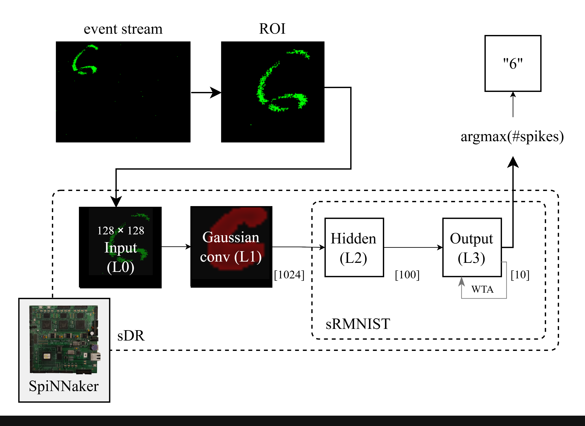

# Neuromorphic digit recognition
This repository contains the code accompanying the bachelor’s thesis: 
**"Neuromorphic active object recognition"** by Vedmedenko Olha. *Czech Technical University in Prague, Faculty of Information Technology*, 2026.



# Pipeline overview
Both the event-stream processing script `process_*` and the SpiNNaker deployment script `spinn_*` must be started for each pipeline: the `process_*` run the inference loop, while the  `spinn_*` scripts stream event data and collect classification outputs.

Training of the proposed sRMNIST SNN was performed as set up in the sRMNIST_training.ipynb notebook.
## sRMNIST evaluation
`configs.py`: configuration classes, including InjectorConfig, ReceiverConfig and ModelConfig for sRMNIST

`process_nmnist.py`: script that handles the streaming of N-MNIST events to the SpiNNaker hardware. It also manages the synchronization between sending spikes through Injector
and collecting classification results with Receiver classes.  

`spinn_sdr`: script that builds an sRMNIST model for deploying on SpiNNaker and starts endless inference loop

`calculate_accuracy`: script that synchronizes event-based predictions with ground-truth data
using timestamps.
## sDR with live camera input (demo)
`configs.py`: configuration classes, including InjectorConfig, ReceiverConfig and ModelConfig for sDR

`process_live_events.py`: script that handles the streaming of live events acquired from DAVIS346 DVS to the SpiNNaker hardware. It also manages the synchronization between sending spikes through Injector
and collecting classification results with Receiver classes.  

`spinn_sdr`: script that builds an sDR model for deploying on SpiNNaker and starts endless inference loop
#### MNIST digit display
`mnist_display.py`: displays MNIST test-set images with animation   

`mnist_settings.yaml`: settings for displaying a digit, such as digit size, window position, animation type etc.

## Helpers
`cell_params.py`: class defining the parameters for neuron populations  

`SpiNNaker_helpers.py`: utility functions to create convolutional connectivity in a neural network
by mapping input neuron indices to output neuron indices based on kernel geometry.

`injector.py` and `injector_srmnist.py`: Injector classes with functions used for streaming live camera data and N-MNIST respectively to a SpiNNaker  

`receiver.py` and `receiver_srmnist.py`: Receiver class for collecting spike outputs from a
SpiNNaker over an Ethernet live connection.


## Datasets
- The MNIST dataset is available at [Kaggle.com](https://www.kaggle.com/datasets/hojjatk/mnist-dataset), originally from [yann.lecun.com](http://yann.lecun.com/exdb/mnist/)
- The N-MNIST dataset is available at [garrickorchard.com](https://www.garrickorchard.com/datasets/n-mnist)

## Repository structure

```
.
├── spiNN_inference/
│   ├── helpers/
│   │   ├── cell_params.py
│   │   ├── injector.py
│   │   ├── injector_srmnist.py
│   │   ├── receiver_nmnist.py
│   │   ├── receiver_nmnist_srmnist.py
│   │   └── SpiNNaker_helpers.py
│   ├── model_weights/
│   ├── sdr_demo/
│   │   ├── digit_display.py/
│   │   │   ├── mnist_display.py
│   │   │   └── mnist_settings.yaml
│   │   ├── configs.py
│   │   ├── process_live_events.py
│   │   └── spinn_sdr.py
│   └── srmnist_evaluation/
│       ├── calculate_accuracy.py
│       ├── configs.py
│       ├── process_nmnist.py
│       └── spinn_srmnist.py
├── sRMNIST_training
│   ├── sRMNIST_training.ipynb
├── requirements.txt
└── README.md
```